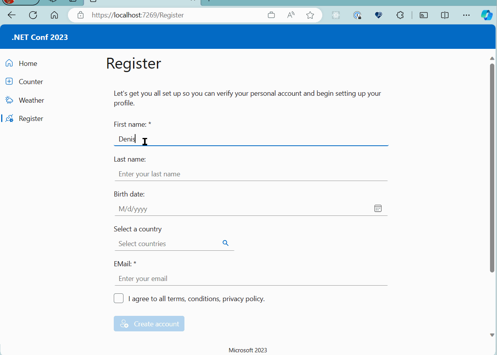
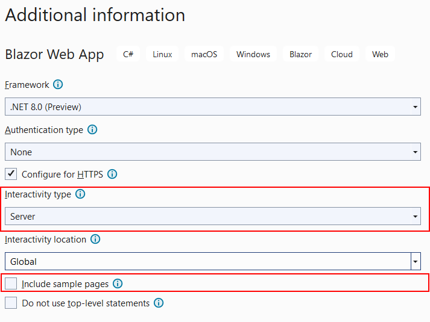
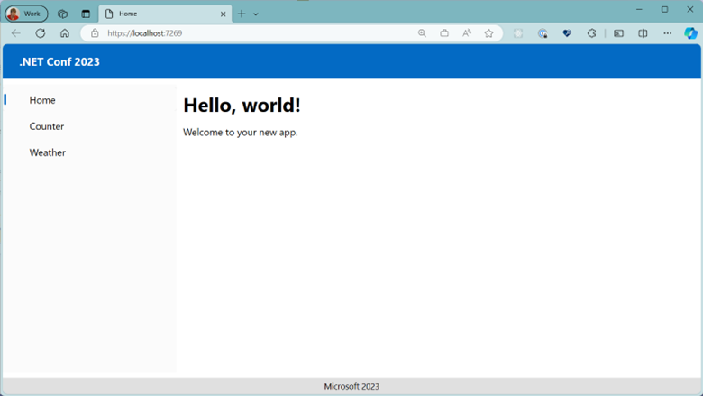
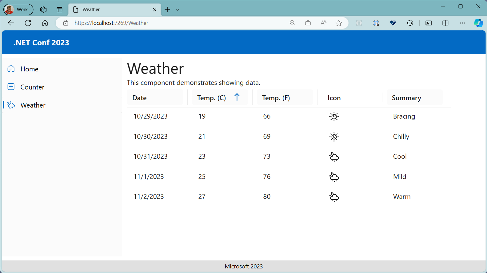
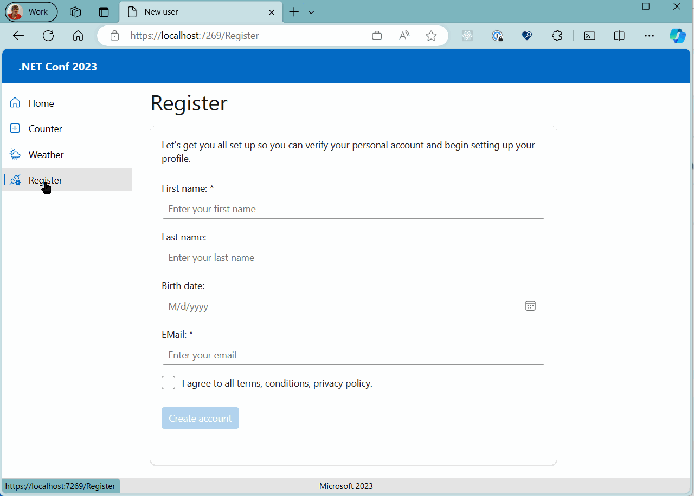
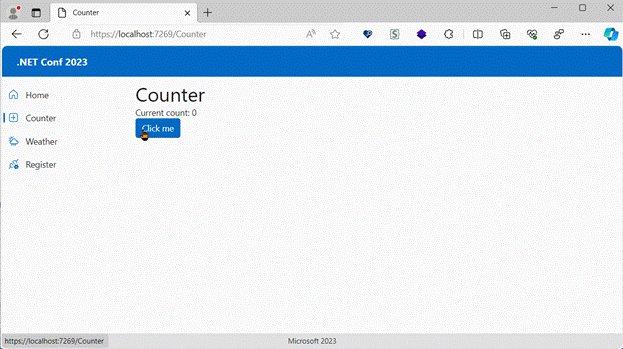

# DotNetConf 2023 - FluentUI Blazor - Quick Start


Demo used during the .NET Conf 2023: Unlocking the power of the Fluent UI Blazor components

This project demonstrates how to use the [FluentUI Blazor Library](https://www.fluentui-blazor.net/).

> **note**: This code is for step-by-step learning only.
> It does not respect development rules and best practices.
> This project presents only a small part of the possibilities offered by **FluentUI Blazor Lib**.
> Some shortcuts have been applied to improve understanding of the project.

## The final result will be



To use **FLuentUI** in your Blazor applications, you must:

## 1. Installation
- Create a new .NET8 Blazor Web App.

- On the **Additional information** screen,
  set **"Interactivity type"** to **Global** and uncheck **Include sample page**.

  

    
- Add the following NuGet packages, searching **"Microsoft FluentUI Components"**
    - [Microsoft.FluentUI.AspNetCore.Components](https://www.nuget.org/packages/Microsoft.FluentUI.AspNetCore.Components)
    - [Microsoft.FluentUI.AspNetCore.Components.Icons](https://www.nuget.org/packages/Microsoft.FluentUI.AspNetCore.Components.Icons)

## 2. Include a Navigation Menu
- Add this namespace to the **_import.razor** file.
    ```csharp
    @using Microsoft.FluentUI.AspNetCore.Components
    ```

- Add this service in **Program.cs**.
    ```csharp
    // Add FluentUI
    builder.Services.AddHttpClient();
    builder.Services.AddFluentUIComponents(options =>
    {
    options.HostingModel = BlazorHostingModel.Hybrid;
    });
    ```

- In the **MainLayout.razor** file, include this code to define a header, a menu, a body and a footer.
    ```xml
    <FluentLayout>
        @* Header *@
        <FluentHeader>
            .NET Conf 2023
        </FluentHeader>

        <FluentBodyContent>
            <FluentStack Orientation="Orientation.Horizontal" Style="height: 100%;">

                @* Left Menu *@
                <FluentNavMenu Width="250" Title="Navigation menu">
                    <FluentNavLink Href="/"
                                Match="NavLinkMatch.All">Home</FluentNavLink>
                    <FluentNavLink Href="/Counter">Counter</FluentNavLink>
                    <FluentNavLink Href="/Weather">Weather</FluentNavLink>
                </FluentNavMenu>

                @* Content *@
                <div class="main-content">
                    @Body
                </div>

            </FluentStack>

        </FluentBodyContent>

        @* Footer *@
        <FluentFooter>
            Microsoft 2023
        </FluentFooter>

    </FluentLayout>
    ```

- Add some styles in App.css.
    ```css
    /* Demo Styles */
    body {
        margin: 0px;
        height: 100vh;
    }

    .footer {
        background-color: var(--neutral-layer-4);
        padding: 4px 0px;
        text-align: center;
    }

    .fluent-nav-menu {
        background-color: var(--neutral-layer-1);
        height: 100%;
    }

    .main-content {
        height: 100%;
        width: 100%;
        padding: 0px 16px;
    }
    ```

- The result will be
  

## 3. Add Icons and Emoji
- Use these site to find **Icons** and **Emoji**.
    - https://www.fluentui-blazor.net/Icon
    - https://www.fluentui-blazor.net/Emoji

- On the Icons page, start a search on **Home**, **Add** (AddSquare) and **Weather** (WeatherRainShowersDay).

- Add these Icons into the **MainLayout.razor** file.

    ```xml
    <FluentNavMenu Width="250" Title="Navigation menu">
        <FluentNavLink Icon="@(new Icons.Regular.Size20.Home())"
                    Href="/" Match="NavLinkMatch.All">Home</FluentNavLink>
        <FluentNavLink Icon="@(new Icons.Regular.Size20.AddSquare())" 
                    Href="/Counter">Counter</FluentNavLink>
        <FluentNavLink Icon="@(new Icons.Regular.Size20.WeatherRainShowersDay())" 
                    Href="/Weather">Weather</FluentNavLink>
    </FluentNavMenu>
    ```

## 4. Add the Counter page

- Go to the **Button** and **Label** pages to display the available styles.
    - https://www.fluentui-blazor.net/Button 
    - https://www.fluentui-blazor.net/Label 

- Add a new file **Counter.razor** under the **Components/Pages** folder.

    ```xml
    @page "/counter"

    <PageTitle>Counter</PageTitle>

    <FluentLabel Typo="Typography.PageTitle">Counter</FluentLabel>
    <FluentLabel role="status">Current count: @currentCount</FluentLabel>
    <FluentButton Appearance="Appearance.Accent"
                OnClick="IncrementCount">
        Click me
    </FluentButton>

    @code {
        private int currentCount = 0;

        private void IncrementCount()
        {
            currentCount++;
        }
    }
    ```

## 5. Add a Weather page

- Open these pages to display the available styles, for **ProgressBar** and **ProgressRing**.
    - https://www.fluentui-blazor.net/Progress 
    - https://www.fluentui-blazor.net/ProgressRing
    - https://www.fluentui-blazor.net/DataGrid 

- Add a new file **Weather.razor** under the **Components/Pages** folder.

    ```xml
    @page "/weather"

    <PageTitle>Weather</PageTitle>

    <FluentLabel Typo="Typography.PageTitle">Weather</FluentLabel>
    <FluentLabel>This component demonstrates showing data.</FluentLabel>

    @if (GridItems == null)
    {
        <FluentProgressRing>Loading...</FluentProgressRing>
    }
    else
    {
        <FluentDataGrid Items="@GridItems" ResizableColumns="true">
            <PropertyColumn Title="Date" Property="@(c => c.Date.ToShortDateString())" 
                            Sortable="true" />
            <PropertyColumn Title="Temp. (C)" Property="@(c => c.TemperatureC)" 
                            Sortable="true" />
            <PropertyColumn Title="Temp. (F)" Property="@(c => c.TemperatureF)" 
                            Sortable="true" />
            <PropertyColumn Title="Summary" Property="@(c => c.Summary)" Sortable="true" />
        </FluentDataGrid>
    }
    ```
    ```csharp
    @code {
        private IQueryable<WeatherForecast>? GridItems;

        protected override async Task OnAfterRenderAsync(bool firstRender)
        {
            if (!firstRender) return;

            // Simulate asynchronous loading to demonstrate streaming rendering
            await Task.Delay(500);

            var Summaries = new[] { "Freezing", "Bracing", "Chilly", "Cool", "Mild",
                                    "Warm", "Balmy", "Hot", "Sweltering", "Scorching" };

            GridItems = Enumerable.Range(1, 5).Select(index => new WeatherForecast
                {
                    Date = DateOnly.FromDateTime(DateTime.Now).AddDays(index),
                    TemperatureC = index * 2 + 17,
                    Summary = Summaries[index],
                }).AsQueryable();

            StateHasChanged();
        }

        private class WeatherForecast
        {
            public DateOnly Date { get; set; }
            public int TemperatureC { get; set; }
            public string? Summary { get; set; }
            public int TemperatureF => 32 + (int)(TemperatureC / 0.5556);
        }
    }
    ```

- Add a **TemplateColumn** including icons.

    ```xml
    <FluentDataGrid Items="@GridItems" ResizableColumns="true">
        <PropertyColumn Title="Date" Property="@(c => c.Date.ToShortDateString())" 
                        Sortable="true" />
        <PropertyColumn Title="Temp. (C)" Property="@(c => c.TemperatureC)" 
                        Sortable="true" />
        <PropertyColumn Title="Temp. (F)" Property="@(c => c.TemperatureF)" 
                        Sortable="true" />
        <!-- ***************************************** -->
        <TemplateColumn Title="Icon">
            @if (context.TemperatureC > 21)
            {
                <FluentIcon Value="@(new Icons.Regular.Size24.WeatherHailNight())" 
                            Color="@Color.Neutral" />
            }
            else
            {
                <FluentIcon Value="@(new Icons.Regular.Size24.TimeAndWeather())" 
                            Color="@Color.Neutral" />
            }
        </TemplateColumn>
        <!-- ***************************************** -->
        <PropertyColumn Title="Summary" Property="@(c => c.Summary)" Sortable="true" />
    </FluentDataGrid>
    ```

- The result will be
  

## 6. Add a Registration page

- Add a new **Register.razor** page with this content.

    ```xml
    @page "/register"

    <PageTitle>New user</PageTitle>

    <FluentLabel Typo="Typography.PageTitle">Register</FluentLabel>

    <FluentCard Style="margin: 16px 0px; padding: 16px; width: 600px; height: 500px;">

        <FluentLabel Style="margin-bottom: 24px;">
            Let's get you all set up so you can verify your personal account and begin
            setting up your profile.
        </FluentLabel>

        <EditForm Model="@Data" OnValidSubmit="ValidHandlerAsync">
            <FluentTextField Label="First name: *"
                            Placeholder="Enter your first name"
                            Required
                            @bind-Value="@Data.FistName" />
            <FluentTextField Label="Last name:"
                            Placeholder="Enter your last name"
                            @bind-Value="@Data.LastName" />
            <FluentDatePicker Label="Birth date:"
                            @bind-Value="@Data.BirthDate" />
            <FluentTextField Label="EMail: *"
                            TextFieldType="TextFieldType.Email"
                            Required
                            Placeholder="Enter your email"
                            @bind-Value="@Data.Email" />

            <FluentCheckbox Label="I agree to all terms, conditions, privacy policy."
                            @bind-Value="@AcceptToCreate" />

            <div style="margin: 24px 0px;" />

            <FluentButton Appearance="Appearance.Accent"
                        Loading="@Loading"
                        Disabled="@(!AcceptToCreate)"
                        Type="ButtonType.Submit">
                Create account
            </FluentButton>
        </EditForm>
    </FluentCard>
    ```

    ```csharp
    @code {
        private RegisterUser Data = new();
        private bool AcceptToCreate = false;
        private bool Loading = false;

        private async Task ValidHandlerAsync()
        {
            Loading = true;

            // Simulate asynchronous loading
            await Task.Delay(1000);

            Loading = false;
        }

        public class RegisterUser
        {
            public string? LastName { get; set; }
            public string? FistName { get; set; }
            public DateTime? BirthDate { get; set; }
            public string? Email { get; set; }
        }
    }
    ```

- Add a new item in the Left Navigation menu.
    ```xml
    <FluentNavLink Icon="@(new Icons.Regular.Size20.PlugConnectedSettings())"
                Href="/Register">Register</FluentNavLink>
    ```

- Add this new style in **App.css** (and check if the main-content is correct)
    ```css
    .main-content {
        height: 100%;
        width: 100%;
        padding: 0px 16px;
    }

    fluent-text-field {
        min-width: 100%;
        margin-bottom: 16px;
    }
    ```

- The result will be
  

# 7. Add an Autocomplete with countries

- Add this class **Country.cs** to have a list of all countries.

  > **note**: Copy the full code from [this file](https://github.com/dvoituron/dotnetconf-2023-fluentui-blazor/blob/steps/07-with-autocomplete-country/src/DemoFluentUI/Components/Pages/Country.cs).

    ```csharp
    namespace DemoFluentUI.Components.Pages;

    using Microsoft.AspNetCore.Components;

    public record Country(string Code, string Name)
    {
        public string Flag => 
        $"https://fluentui-blazor.net/_content/FluentUI.Demo.Shared/flags/{Code}.svg";

        public MarkupString HtmlFlagAndName => (MarkupString)
            @$"<div style=""display: flex; gap: 10px;"">
                
                <div>{Name}</div>
            </div>";

        public static IEnumerable<Country> All
        {
            get
            {
                // List generated using https://chat.openai.com/
                return new Country[]
                {
                    new Country("af", "Afghanistan"),
                    new Country("al", "Albania"),
                    new Country("dz", "Algeria"),
                    new Country("as", "American Samoa"),
                    new Country("ad", "Andorra"),

                    ... // Copy All Countries from the GitHub source code (see the note above).

                    new Country("ye", "Yemen"),
                    new Country("zm", "Zambia"),
                    new Country("zw", "Zimbabwe"),
                };
            }
        }
    }
    ```

    - Update the **Register.razor** file to add the **FluentAutocomplete** component

    ```xml
    @page "/register"
        ...
        <EditForm Model="@Data" OnValidSubmit="ValidHandlerAsync">
            ...
            @* Country *@
            <FluentAutocomplete TOption="Country"
                                Label="Select a country"
                                Width="250px"
                                Placeholder="Select countries"
                                OnOptionsSearch="@OnSearchAsync"
                                MaximumSelectedOptions="1"
                                OptionText="@(i => i.Name)"
                                @bind-SelectedOptions="@Data.Languages">

                <OptionTemplate Context="language">
                    @language.HtmlFlagAndName
                </OptionTemplate>

                <MaximumSelectedOptionsMessage>
                    Please select only one country.
                </MaximumSelectedOptionsMessage>
            </FluentAutocomplete>
        </EditForm>
    ```

    ```csharp
    @code {
        ...

        // Add this new method
        private async Task OnSearchAsync(OptionsSearchEventArgs<Country> e)
        {
            e.Items = Country.All.Where(i => i.Name.StartsWith(e.Text, 
                                                    StringComparison.OrdinalIgnoreCase))
                                .OrderBy(i => i.Name);

            await Task.CompletedTask;
        }

        public class RegisterUser
        {
            public string? LastName { get; set; }
            public string? FistName { get; set; }
            public DateTime? BirthDate { get; set; }
            public string? Email { get; set; }

            // Add this new line
            public IEnumerable<Country> Languages { get; set; } = Array.Empty<Country>();
        }
    }
    ```

# 8. Add Themes: Colors, Dark and Light

- Open the file **Home.razor** and inject these two services.

    ```csharp
    @using Microsoft.FluentUI.AspNetCore.Components.DesignTokens
    @inject BaseLayerLuminance BaseLayerLuminance
    @inject AccentBaseColor AccentBaseColor
    ```

- In the same file, add these Settings components.
    ```xml
    <FluentStack Orientation="Orientation.Vertical" Style="margin-top: 32px;">
        <FluentLabel Typo="Typography.PageTitle">Settings</FluentLabel>

        <FluentSelect Label="Color"
                    Items=@(Enum.GetValues<OfficeColor>())
                    Height="200px"
                    @bind-SelectedOption="@Color" />

        <FluentSwitch Label="Theme"
                    Style="margin-top: 16px;"
                    UncheckedMessage="Light"
                    CheckedMessage="Dark"
                    @bind-Value="@IsDark" />
    </FluentStack>
    ```
    ```csharp
    @code {
        private OfficeColor _color = OfficeColor.Default;
        private bool _isDark = false;

        public OfficeColor Color
        {
            get => _color;
            set
            {
                _color = value;

                var colorHex = _color.ToAttributeValue() ?? "default";
                AccentBaseColor.WithDefault(colorHex.ToSwatch());
            }
        }

        public bool IsDark
        {
            get => _isDark;
            set
            {
                _isDark = value;

                var luminance = _isDark
                            ? StandardLuminance.DarkMode
                            : StandardLuminance.LightMode;
                BaseLayerLuminance.WithDefault(luminance.GetLuminanceValue());
            }
        }
    }
    ```

- In the MainLayout.razor file, update the FluentLayout styles to use the predefined colors.

    ```xml
    <FluentLayout Style="background-color: var(--neutral-layer-1);
                        color: var(--neutral-foreground-rest);">
    ```

- The result will be
  

# 9. Add a confirmation Dialog

- Update the **Registry.razor** page to include an **IconStart** to the **Create account** button.

    ```xml
    <FluentButton Appearance="Appearance.Accent"
                  Loading="@Loading"
                  IconStart="@(new Icons.Regular.Size20.PersonAdd())"
                  Disabled="@(!AcceptToCreate)"
                  Type="ButtonType.Submit">
        Create account
    </FluentButton>
    ```

- At the end of the **MainLayout.razor** file, add this line.

    ```xml
    <FluentDialogProvider />
    ```

- In the **Registry.razor** page, inject this service and add the **Dialog Message**.

    ```csharp
    @inject IDialogService DialogService

    private async Task ValidHandlerAsync()
    {
        Loading = true;

        // Simulate asynchronous loading
        await Task.Delay(1000);

        // Confirmation
        await DialogService.ShowInfoAsync(
                    message: "Your account has been successfully created",
                    title: "New user");

        Loading = false;
    }
    ```

- Add this new **AccountCreatedDialog.razor** file to customize the Dialog content.

    ```xml
    @implements IDialogContentComponent

    @* Header *@
    <FluentDialogHeader ShowDismiss="true">
        <FluentStack VerticalAlignment="VerticalAlignment.Center">
            <FluentIcon Value="@(new Icons.Regular.Size24.PersonAdd())" />
            <FluentLabel Typo="Typography.PaneHeader">
                @Dialog.Instance.Parameters.Title
            </FluentLabel>
        </FluentStack>
    </FluentDialogHeader>

    @* Footer *@
    <FluentDialogFooter>
        <FluentButton Appearance="Appearance.Accent"
                    OnClick="@SaveAsync">
            Close
        </FluentButton>
    </FluentDialogFooter>

    @* Body *@
    <FluentDialogBody>
        <FluentLabel Typo="Typography.Subject" MarginBlock="10px;">
            Thanks for being awesome!
        </FluentLabel>
        <FluentLabel>
            Thank you for registering your new request.
            If your request is urgent, please use our telephone number to speak to one
            of our customer service representatives.
            You can also reach us via <a href="https://dotnet.microsoft.com" 
                                        target="_blank">our documentation page</a>.
        </FluentLabel>
    </FluentDialogBody>

    @code {
        [CascadingParameter]
        public FluentDialog Dialog { get; set; } = default!;

        private async Task SaveAsync()
        {
            await Dialog.CloseAsync();
        }
    }
    ```
- Replace the previous **DialogService.ShowInfoAsync** method by this new 
  `ShowDialogAsync<AccountCreatedDialog>`, to call the customized dialog box.

    ```csharp
    // await DialogService.ShowInfoAsync("Your account has been successfully created",
    //                                   "New user");

    await DialogService.ShowDialogAsync<AccountCreatedDialog>(new DialogParameters()
    {
        Title = "New user",
    });
    ```

# 10. Replace by a Toast message

- At the end of the MainLayout.razor file, add this line.
    ```xml
    <FluentToastContainer />
    ```

    > 📝 Since version **V4-Preview.3**, this tag was renamed to **FluentToastProvider**.

- (Optional) In the **App.css** file, add this style to fix.

    ```css
    /* Fixed in FluentUI.Blazor V4 Preview 3 */
    .fluent-toast {
        font-family: var(--body-font);
    }
    ```


- Update the **Registry.razor** file.

    ```xml
    <FluentToastContainer />
    ```

- In the **Registry.razor** page, inject this service and add the **Toast** Message.

    ```csharp
    @inject IDialogService DialogService

    private async Task ValidHandlerAsync()
    {
        Loading = true;

        // Simulate asynchronous loading
        await Task.Delay(1000);

        // Confirmation
        // await DialogService.ShowInfoAsync("Your account has been successfully created",
        //                                   "New user");

        // await DialogService.ShowDialogAsync<AccountCreatedDialog>(new DialogParameters()
        // {
        //     Title = "New user",
        // });

        ToastService.ShowSuccess("Your account has been successfully created");

        Loading = false;
    }
    ```
